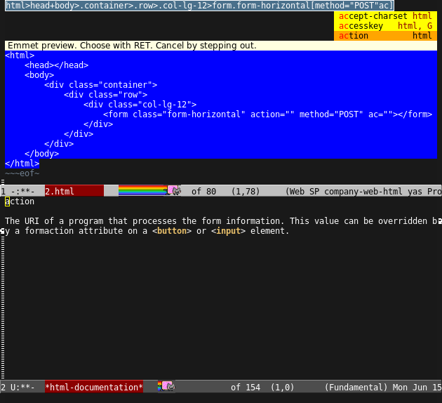

# Company-web

[](https://travis-ci.org/osv/company-web)

Company-web is an alternative emacs plugin for autocompletion in html-mode, web-mode, jade-mode, slim-mode
and use data of [ac-html](https://github.com/cheunghy/ac-html).
It uses [company-mode](http://company-mode.github.io).

## Setup

Install `company` via Melpa.

Add the following to your emacs-config:

```lisp
(require 'company)                                   ; load company mode
(require 'company-web-html)                          ; load company mode html backend
;; and/or
(require 'company-web-jade)                          ; load company mode jade backend
(require 'company-web-slim)                          ; load company mode slim backend

;; you may key bind, for example for web-mode:
(define-key web-mode-map (kbd "C-'") 'company-web-html)
```

Additionally you may want install `ac-html-csswatcher` and `ac-html-bootstrap`.

## Possible improvements of company-mode

```lisp
;; (setq company-minimum-prefix-length 0)            ; WARNING, probably you will get perfomance issue if min len is 0!
(setq company-tooltip-limit 20)                      ; bigger popup window
(setq company-tooltip-align-annotations 't)          ; align annotations to the right tooltip border
(setq company-idle-delay .3)                         ; decrease delay before autocompletion popup shows
(setq company-begin-commands '(self-insert-command)) ; start autocompletion only after typing
(global-set-key (kbd "C-c /") 'company-files)        ; Force complete file names on "C-c /" key
```

Also very useful is package `company-statistics` for sort candidates using completion history.

### Only use company-mode with company-web-html in web-mode
By default company-mode loads every backend it has. If you want to only have company-mode enabled in web-mode add the following to your emacs-config:

```lisp
(add-hook 'web-mode-hook (lambda ()
                          (set (make-local-variable 'company-backends) '(company-web-html))
                          (company-mode t)))
```

### Emmet integration

Company-web support integration with `emmet-mode` and `emmet-preview` and add some advices to make `C-g` and `RET` keys work properly.



### Color customization

```lisp
(custom-set-faces
 '(company-preview
   ((t (:foreground "darkgray" :underline t))))
 '(company-preview-common
   ((t (:inherit company-preview))))
 '(company-tooltip
   ((t (:background "lightgray" :foreground "black"))))
 '(company-tooltip-selection
   ((t (:background "steelblue" :foreground "white"))))
 '(company-tooltip-common
   ((((type x)) (:inherit company-tooltip :weight bold))
    (t (:inherit company-tooltip))))
 '(company-tooltip-common-selection
   ((((type x)) (:inherit company-tooltip-selection :weight bold))
    (t (:inherit company-tooltip-selection)))))
```

If you want to add Tern completion support in web-mode with company-mode.
You can add this into your `.emacs`:
```lisp
(defun my-web-mode-hook ()
  "Hook for `web-mode'."
    (set (make-local-variable 'company-backends)
         '(company-tern company-web-html company-yasnippet company-files)))

(add-hook 'web-mode-hook 'my-web-mode-hook)

;; Enable JavaScript completion between <script>...</script> etc.
(advice-add 'company-tern :before
            #'(lambda (&rest _)
                (if (equal major-mode 'web-mode)
                    (let ((web-mode-cur-language
                          (web-mode-language-at-pos)))
                      (if (or (string= web-mode-cur-language "javascript")
                              (string= web-mode-cur-language "jsx"))
                          (unless tern-mode (tern-mode))
                        (if tern-mode (tern-mode -1)))))))

;; manual autocomplete
(define-key web-mode-map (kbd "M-SPC") 'company-complete)

```

### Related projects

You may be interested in next projects:

- [ac-html](https://github.com/cheunghy/ac-html) - Same as company-web, but `auto-completion` completion framework used;
- [ac-html-angular](https://github.com/osv/ac-html-angular) - Angular 1.5 completion data;
- [ac-html-bootstrap](https://github.com/osv/ac-html-bootstrap) - Twitter:Bootstrap and Font Awesome;
- [ac-html-csswatcher](https://github.com/osv/ac-html-csswatcher) - Parse your project's CSS/Less and build completion (classes, ids)

